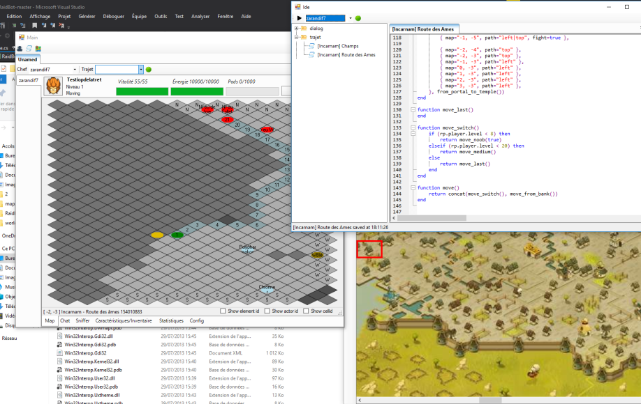

# Dofus Multi-Instance Bot

## ⚠️ Educational Purpose Only
This project was developed strictly for educational purposes to understand game automation, network protocols [..]. **Do not use this bot in the actual game as it violates Dofus' Terms of Service.**

## 📖 Overview
This bot emulates multiple Dofus game instances in parallel and allows them to work together cooperatively. The bot is able to perform common actions such as pathfinding, resource gathering, combat. All of this is driven by a LUA scripting engine that can be extended with plugins.

## 🔧 Technical Features
- Full emulation of a Dofus client
    - Authentication with bypasss of the various anti-bot techniques used by Ankama.
    - Automatic packet translation from the desassembled code of the game  to C# code.
- Management of multiple concurrent game instances with proxy rotation.
- Dynamic plugin system to add new features from external DLLs.
- LUA Scripting engine to write complex scenarios.
- Resource gathering and farming capabilities.
- Combat system automation with basic AI.
- Instance coordination for group activities.
- Rich GUI with a fully featured script editor.

## 🛠️ Prerequisites
- Visual Studio 15 or greater
- Dofus client (I used the 2.69 version)

## ⚖️ Legal Disclaimer
This project is for **educational purposes only**. Using bots or automation tools in Dofus is against the game's Terms of Service and can result in account bans. The authors do not endorse or encourage the use of this code in the actual game.

## 🤝 Contributing
This is an educational project. Feel free to fork and expand upon it for your own learning purposes.
